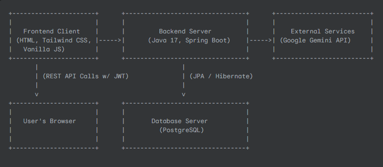
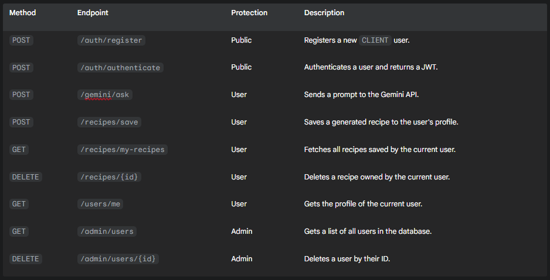

🤖 AI Chef - Your Personal AI Sous-Chef 👨‍🍳

  

A full-stack, AI-powered web application that transforms your leftover ingredients into culinary masterpieces. Built with a secure Java Spring Boot backend and a polished, responsive frontend.

### 🏠 Home

---

### 🔐 Login

---

### 🍳 Output (Recipe Generator)

---

### 📄 Recipie Page

---

### 🛒 Shopping List Suggestor

---

### 📋 View Saved Recipe

---

### 🍹 Drink Suggestion

📖 Table of Contents
The Vision

Architectural Overview

Core Features

Technology Deep Dive

Local Setup & Installation

API Endpoints

Future Roadmap

Contact

🎯 The Vision
In a world of food waste and decision fatigue, AI Chef emerges as an intelligent solution. The goal of this project was not just to build a simple recipe generator, but to create a complete, secure, and user-centric platform that demonstrates modern full-stack development principles. It tackles the common problem of "what can I make with what I have?" by leveraging the creative power of Large Language Models, wrapped in a robust and scalable Java backend and presented through a beautiful, intuitive user interface.

This project showcases a deep understanding of backend security, database management, external API integration, and frontend design, making it a comprehensive portfolio piece.

🏗️ Architectural Overview
The application follows a classic three-tier architecture, with a decoupled frontend and backend communicating via a RESTful API.

Workflow:

The user interacts with the Frontend Client in their browser.

For secure actions (like generating recipes), the client sends an HTTP request containing a JWT to the Backend Server.

The Spring Security layer on the backend validates the JWT.

The appropriate Controller handles the request and calls a Service.

The Service contains the business logic. It may call the external Google Gemini API or interact with the PostgreSQL Database via the JPA Repository.

The backend sends a JSON response back to the frontend, which then updates the UI dynamically.

✨ Core Features
User Experience & AI
Dynamic Recipe Generation: Users provide ingredients and dietary needs to get a complete recipe, including cooking time, serving size, and nutritional info.

AI-Powered Tools:

Shopping List Generator: Instantly creates a categorized shopping list from a recipe's ingredients.

Intelligent Drink Pairing: Suggests both alcoholic and non-alcoholic drink pairings with explanations.

Personal Recipe Book: Users can save their favorite recipes to their personal account.

Polished & Responsive UI: A premium, "Apple-level" user interface designed with Tailwind CSS that works beautifully on all devices.

Security & Authentication
End-to-End Security: Full user registration and login system powered by Spring Security.

Stateless Authentication: Utilizes JSON Web Tokens (JWT) for secure, stateless API communication. Passwords are never stored in plain text (hashed with BCrypt).

Role-Based Access Control (RBAC):

CLIENT Role: Standard user access to generate and save recipes.

ADMIN Role: Access to a separate, secure admin dashboard.

Protected Endpoints: API endpoints are secured based on user roles, preventing unauthorized access.

Administration
Admin Dashboard: A dedicated UI for administrators to view and manage all registered users in the system.

User Management: Admins have the ability to delete users directly from the dashboard.

🔬 Technology Deep Dive
Why this stack?
Spring Boot (Java) was chosen for its robustness, scalability, and powerful ecosystem. Its "convention over configuration" philosophy speeds up development while its vast libraries, especially Spring Security and Spring Data JPA, provide enterprise-grade features out of the box.

PostgreSQL was selected as the database for its reliability, feature-richness, and strong support for complex queries, making it ideal for a production-ready application.

JWT Authentication was implemented to create a stateless backend, which is crucial for modern, scalable web applications. It simplifies the architecture by not requiring server-side session management.

Vanilla JavaScript & Tailwind CSS were chosen for the frontend to create a fast, lightweight, and highly customized user experience without the overhead of a large framework. Tailwind's utility-first approach allows for rapid development of bespoke, beautiful designs.

🚀 Local Setup & Installation
1. Prerequisites
   Java JDK 17 or later.

Apache Maven.

PostgreSQL installed and running.

A Google Gemini API Key.

2. Clone & Configure
# Clone the repository
git clone [https://github.com/harsh-mali/Spring_AI_API.git](https://github.com/harsh-mali/Spring_AI_API.git)
cd Spring_AI_API

3. Database Setup
   Open pgAdmin or your preferred PostgreSQL client.

Create a new, empty database named ai_recipes_db.

4. Environment Variables
   This project requires two environment variables. The most secure way to set them is in your IDE's run configuration.

GOOGLE_API_KEY: Your personal API key for the Google Gemini service.

JWT_SECRET_KEY: A long, random, and secure string for signing JWTs. You can generate one easily using a tool like openssl rand -base64 48 in your terminal.

5. Application Properties
   Navigate to src/main/resources/application.properties.

Update the following lines with your PostgreSQL credentials:

spring.datasource.username=your_postgres_username
spring.datasource.password=your_postgres_password

6. Run the Application
# Use the Maven wrapper to run the application
./mvnw spring-boot:run

The backend will now be running on http://localhost:8080.

7. Accessing the App
   Client View: Navigate to http://localhost:8080/login.html to register and log in.

Admin View:

Register a new user.

In pgAdmin, find your user in the _user table and manually change their role from CLIENT to ADMIN.

Log out and log back in. You will be automatically redirected to the admin dashboard at http://localhost:8080/admin.html.

📡 API Endpoints
All endpoints are prefixed with /api/v1.

🗺️ Future Roadmap
[ ] User Profile Page: Implement a page for users to view their details and change their password.

[ ] Recipe Image Generation: Add a feature to call an image generation AI (like Imagen) to create a photo for each generated recipe.

[ ] Advanced Search & Filtering: Allow users to search their saved recipes by ingredient or title.

[ ] Deployment: Deploy the application to a cloud service like Render or Heroku for public access.

📧 Contact
Harsh Mali - harsh8smali@gmail.com

Project Link: https://github.com/harsh-mali/Spring_AI_API